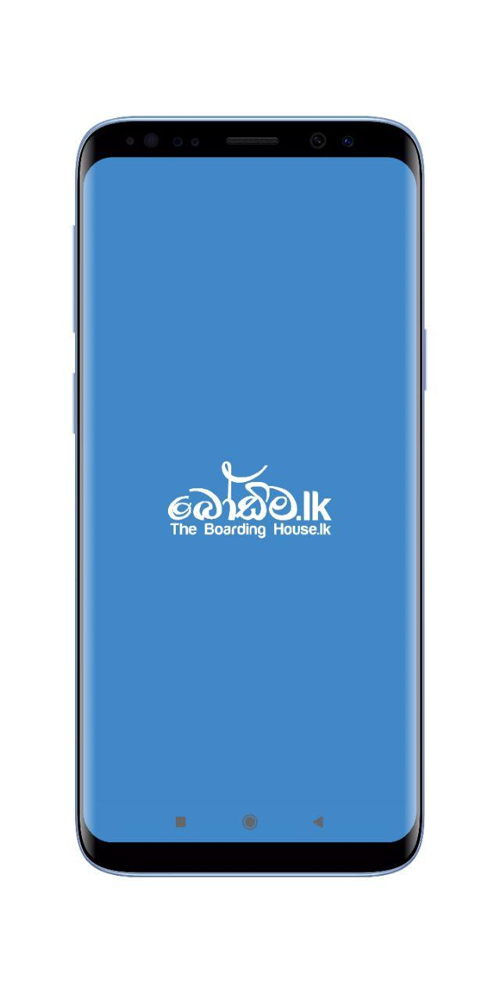
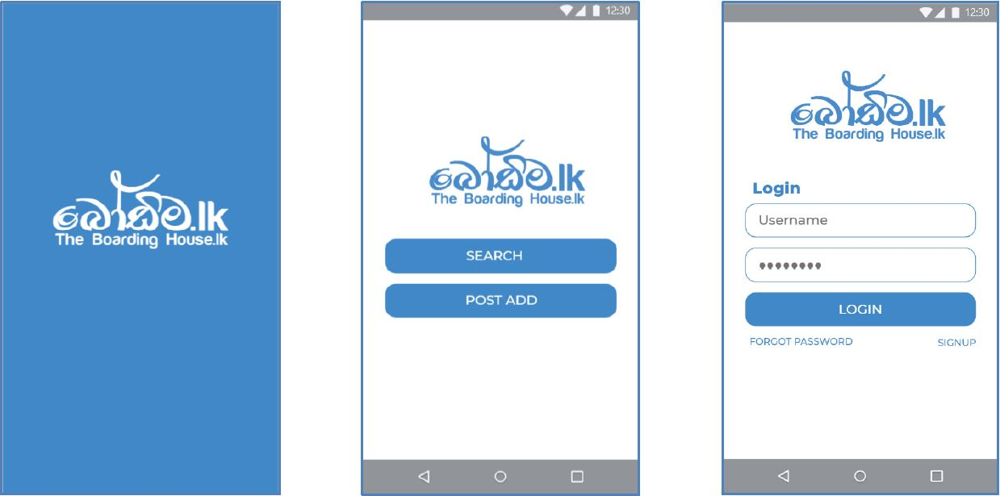
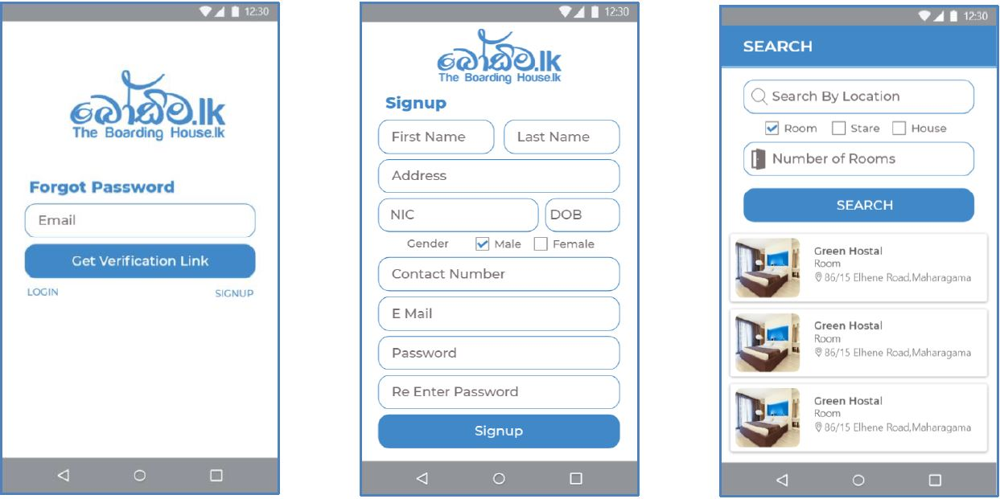
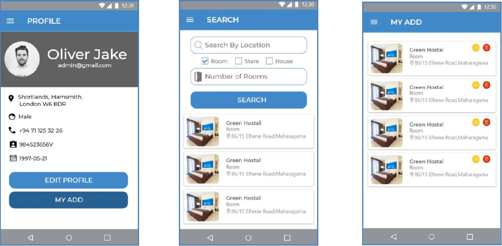

# Bordima Android Application

## Introduction of Application

    <body>
          The high development of internet user’s makes e-commerce is a beneficial business opportunity. In e- commerce there are no physical interaction between the market, 
          buyers, vendors and payments. This has happened; it can be useful because the owners of the business can use mobile phone support technology optimization of selected 
          business process. Such mobile business processes are often found in industries sales or service objectives. Today, it is at the current stage of maturity in Sri Lanka 
          and become attention to business. Currently the development of content and services related to IT as it opens new opportunities; it encourages business hiring with 
          entirely new content and helping the communities. At present finding a boarding place or an apartment, a room, a house, or an annex for rental or permanent residence 
          has become a serious tiring tough and time consuming job in Sri Lanka, especially in the Colombo District. But these tasks can be made easy by using mobile application 
          or web sites, which can help a person, find a house. Smartphone era app can make this task easier. These mobile apps do this to find a home or house for rent hunting.   
          The proposed system has the capabilities to help a student to locate nearby boarding house, room, annex, apartment or house not to mention, save time and effort in finding available 
          units for rent. The application could also help the property owners to promote their apartments by simply uploading the pictures of their units. The study aims to develop a system for 
          finding boarding house, room, annex, apartment or house aptly named as boadima.lk.  
     </body>
     

         <body>Used Technologies and Services.</body>
     

       <ul>
           <li>Android Studio</li>
           <li>Firebase Database</li>
           <li>Firebase Authentication</li>
           <li>Firebase Storage</li>
           <li>Google Map</li>
           <li>Picasso</li>
           <li>Regex Validation (Validate User Input)</li>
           <li>Decimal to Hexa decimal</li>
       </ul>

## Application UI

          <body>User Functions.</body>
     

       <ul>
           <li>Create Accout</li>
           <li>Password Reset Option</li>
           <li>Users can categorize their own advertisement required category.</li>
           <li>The advertisement has all details.</li>
           <li>Users can see categorized advertisements. (House,Floors,Rooms)</li>
           <li>Users can see places and road using google maps.</li>
           <li>User can see his profile.</li>
           <li>Users have an advertisement search functions.</li>
       </ul>
  
       
## Application Goal

   <body>
       The proposed system has the capabilities to help a student to locate nearby boarding houses, rooms, annexes, apartments and houses, not to mention, save time and effort in finding available 
        units for rent. The application could also help the property owners to promote their property by simply uploading the pictures of their units.   This android-based apartment locator application 
        is a mobile one that can be used by the community especially students, easily find boarding house, room, annex, apartment and house. It can also help owners promote their businesses. To attain this, 
        the proponents gathered user requirements such as standards of tenants in selecting an apartment and issues and concerns encountered by both the owners and tenants for the development of a mobile application. 
        With the help of this app, one can post a flat for sale, find a new boarding house, room, annex, apartment and house to rent or buy, search for a hostel, and look up new localities.   Real time boarding house, 
        room, annex, apartment and house information is currently growing which much provides more good services to make renters life easier. Once mobile locator application has been established in the business will help users 
        to personalize their search and reduce the amount of time wasted on a bad rental fit. It helps to save time and money because it can assist to set a budget looking for apartment you can afford. Anticipating the 
        requirement of the mobile user because community is demanding they want things easier, more commonly seek location based relevant information such as nearby store restaurant, schools, and share their location. You 
        can use internet to search apartment without leaving you home and easier to get information about apartment through the mobile and web system that serve a search engine for apartment and house locator.
   </body>

<h1 align="center">Thank You....!!</h1>
